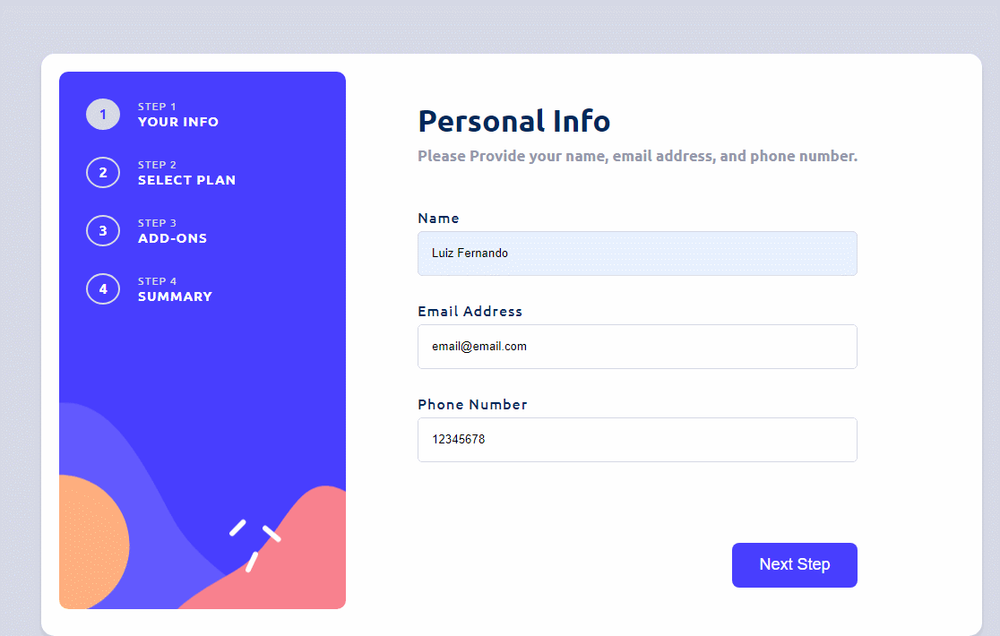

# Formulário reativo de Múltiplas Etapas com Angular

## Tecnologias Utilizadas

- Angular versão: 15.2.9
- TypeScript versão: 4.9.5
- CSS

## Serviços Usados

- GitHub

## Características
- **Formulario reativo**
- **Intuitivo e dinamico**
- **Alteração entre mensal e anual**
- **100% responsivo**
- **Fácil integração com BackEnd para enviar os dados ou aplicar validações personalizadas nos campos**

## Links
- Repositório: https://github.com/LFzinn/Mult-Step-Form. 
Em caso de encontrar algum bug ou inconsistência, por favor, entre em contato comigo através do [LinkedIn](https://www.linkedin.com/in/lfsilvaferreira/)

## Versão

1.0.0.0

## Autor
**Luiz Fernando Silva**

## Projeto

### Completo:

